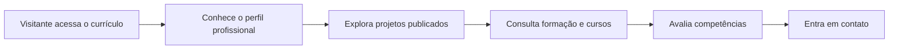

<div align="center">

# Currículo - André Gomes

### Portfólio pessoal para apresentar projetos, formação, competências e contatos profissionais


**Projeto pessoal desenvolvido como currículo digital e vitrine de evolução em desenvolvimento web.**

[Acessar página publicada](https://radekradke.github.io/curriculo/)

</div>

---

## Visão Geral

Este projeto é um **currículo digital** criado para apresentar minha trajetória, meus projetos e minhas habilidades de forma mais visual e direta do que um currículo tradicional.

A ideia foi construir uma página simples, responsiva e com personalidade, reunindo em um só lugar quem eu sou como desenvolvedor, quais projetos já publiquei, minha formação acadêmica, cursos complementares, competências e formas de contato.

Mais do que listar informações, o site funciona como uma pequena vitrine: ele mostra o que eu venho construindo e como venho evoluindo na prática.

---

## Objetivo Do Projeto

O objetivo principal foi criar uma presença profissional própria, usando tecnologias fundamentais da web.

O site foi pensado para:

- apresentar meu perfil como desenvolvedor Front End e Mobile;
- reunir projetos reais publicados;
- destacar habilidades técnicas e de design;
- mostrar formação acadêmica e cursos complementares;
- facilitar contato profissional;
- servir como base visual para meu portfólio no GitHub.

---

## Seções Do Site

| Seção | Conteúdo |
| --- | --- |
| **Introdução** | Apresentação pessoal, área de atuação e localização |
| **Projetos** | Trabalhos publicados como Voo Nobre, Ju Acessórios e Easy Visa |
| **Formação** | Graduação em Ciência da Computação e previsão de conclusão |
| **Cursos** | Estudos complementares em lógica, mobile e UI/UX |
| **Competências** | Soft skills e pontos fortes profissionais |
| **Contato** | Email, telefone, Instagram, GitHub e chamada para conversa |

---

## Projetos Em Destaque

| Projeto | Descrição | Status |
| --- | --- | --- |
| **Voo Nobre** | Site institucional para agência de viagens, com foco em presença digital e geração de leads | Online |
| **Ju Acessórios** | Mostruário digital com catálogo, sacola e envio de pedido pelo WhatsApp | Online |
| **Easy Visa** | Landing page para consultoria de vistos com fluxo de agendamento e pagamento | Em andamento |

---

## Fluxo Da Página



---

## Stack Técnica

| Tecnologia | Uso no projeto |
| --- | --- |
| **HTML5** | Estrutura das seções e conteúdo da página |
| **CSS3** | Layout, responsividade, estilos e identidade visual |
| **JavaScript** | Animações de entrada e efeito de digitação |
| **Intersection Observer** | Ativação de elementos conforme aparecem na tela |
| **SVG** | Ícones, logo e detalhes visuais |
| **GitHub Pages** | Publicação do currículo online |

---

## Estrutura Do Projeto

```text
.
|-- index.html
|-- script.js
|-- CSS
|   |-- style.css
|   |-- global.css
|   |-- header.css
|   |-- introducao.css
|   |-- projetos.css
|   |-- formacao.css
|   `-- footer.css
|-- img
|   |-- perfil.png
|   |-- logo.svg
|   |-- github.svg
|   |-- email.svg
|   |-- insta.svg
|   `-- wpp.svg
`-- README.md
```

---

## Interações

O projeto usa JavaScript para deixar a experiência mais viva sem pesar a página.

Entre os detalhes implementados estão:

- animação de entrada nos cards de projetos;
- animação de entrada na formação, cursos e competências;
- efeito de digitação no texto da seção de projetos;
- navegação por âncoras entre seções;
- links externos abrindo em nova aba para os projetos publicados.

---

## Minha Atuação

Neste projeto, trabalhei a construção completa da página, desde a estrutura HTML até a organização visual em CSS e pequenas interações em JavaScript.

O foco foi criar uma apresentação pessoal que fosse simples, objetiva e honesta: sem excesso de elementos, mas com cuidado suficiente para mostrar atenção a layout, hierarquia visual, responsividade e experiência de leitura.

Pontos trabalhados:

- estruturação semântica do currículo;
- separação do CSS por seções;
- composição visual da apresentação;
- cards de projetos reais;
- animações com JavaScript;
- organização de formação, cursos e competências;
- publicação via GitHub Pages.

---

## O Que Este Projeto Demonstra

| Competência | Aplicação |
| --- | --- |
| **HTML e semântica** | Organização clara das seções do currículo |
| **CSS modular** | Arquivos separados por áreas da interface |
| **Responsividade** | Layout pensado para diferentes tamanhos de tela |
| **JavaScript vanilla** | Animações e efeitos sem framework |
| **Portfólio real** | Projetos publicados e acessíveis ao visitante |
| **Apresentação profissional** | Currículo com identidade visual própria |

---

## Nota De Portfólio

Este projeto representa minha base pública de apresentação como desenvolvedor. Ele funciona como ponto de entrada para conhecer meus projetos, minha formação e meu momento atual de evolução técnica.

A proposta é simples: mostrar, de forma direta, o que venho estudando, construindo e colocando no ar.

<div align="center">

**Currículo digital - uma página para apresentar trajetória, projetos e vontade de evoluir.**

</div>
