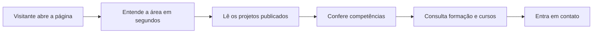

<div align="center">

# Currículo - André Gomes

### Portfólio pessoal para apresentar trajetória, projetos, competências, formação e contatos profissionais


**Projeto pessoal desenvolvido como portfólio profissional e vitrine de evolução em desenvolvimento web.**

[Acessar página publicada](https://radekradke.github.io/curriculo/)

</div>

---

## Visão Geral

Este projeto é o meu **portfólio profissional**: uma página única que apresenta quem eu sou, o que eu faço,
os projetos que coloquei no ar, minhas competências e como falar comigo.

A construção parte de uma ideia simples: um currículo em PDF entrega informação, mas não entrega presença.
A página resolve isso com uma leitura editorial — tipografia grande, bastante espaço em branco,
hierarquia clara e dados apresentados como números, e não como listas genéricas.

---

## Objetivo Do Projeto

Criar uma presença profissional própria, usando tecnologias fundamentais da web, capaz de responder
em poucos segundos às perguntas que um recrutador, empresa ou cliente faz ao abrir a página:

- quem é a pessoa e qual a sua área;
- o que ela já construiu e publicou;
- quais competências aplica na prática;
- qual a sua formação;
- como entrar em contato.

---

## Seções Do Site

| Seção | Conteúdo |
| --- | --- |
| **Apresentação** | Área de atuação, localização, resumo profissional e atalhos de contato |
| **Indicadores** | Números reais: projetos publicados, carga horária de cursos, linguagens e prazo da graduação |
| **(01) Trabalho selecionado** | Voo Nobre, Ju\*Acessórios e Easy Visa, com ano, atuação, foco e tecnologias |
| **(02) Competências** | Organizadas por contexto: front end, back end, design, mobile e processo |
| **(03) Formação** | Graduação em Ciência da Computação e cursos complementares com carga horária |
| **(04) Contato** | E-mail, telefone/WhatsApp, GitHub e Instagram |

> A seção de **experiência profissional** já está estruturada em HTML e CSS, comentada no `index.html`.
> Basta descomentar e preencher quando houver empresas, cargos e períodos para publicar.

---

## Projetos Em Destaque

| Projeto | Descrição | Status |
| --- | --- | --- |
| **Voo Nobre** | Site institucional para agência de viagens, com formulário em PHP e foco em geração de leads | Online |
| **Ju\*Acessórios** | Mostruário digital com catálogo, sacola em JavaScript e envio do pedido pelo WhatsApp | Online |
| **Easy Visa** | Página para consultoria de vistos com fluxo de agendamento e pagamento | Em andamento |

---

## Direção Visual

| Decisão | Motivo |
| --- | --- |
| **Fundo em tom de papel (`#F2F0EB`)** | Leitura calma, longe do branco puro e do visual de template |
| **Serifada de display + grotesca + monoespaçada** | Contraste entre títulos editoriais, texto corrido e metadados técnicos |
| **Um único acento (`#9A4A24`)** | Evita paleta espalhada; a cor marca só o que precisa de atenção |
| **Régua fina entre blocos** | Estrutura de página impressa, sem caixas e sombras |
| **Números como elemento gráfico** | Projetos, carga horária e prazos ganham peso visual |
| **Sem barras de progresso ou grade de ícones** | Competência é descrita pelo contexto de uso, não por porcentagem |

---

## Fluxo Da Página



---

## Stack Técnica

| Tecnologia | Uso no projeto |
| --- | --- |
| **HTML5** | Estrutura semântica das seções e do conteúdo |
| **CSS3** | Design, grid, tipografia fluida e responsividade |
| **JavaScript** | Revelação dos blocos, estado do cabeçalho e menu ativo |
| **Intersection Observer** | Detecção do que entra na tela durante a rolagem |
| **Google Fonts** | Instrument Serif, Archivo e JetBrains Mono |
| **GitHub Pages** | Publicação do site |

---

## Estrutura Do Projeto

```text
.
|-- index.html
|-- script.js
|-- CSS
|   |-- style.css          # importa os blocos na ordem da página
|   |-- base.css           # variáveis, reset, tipografia e estruturas repetidas
|   |-- cabecalho.css      # marca e navegação
|   |-- apresentacao.css   # primeira dobra e indicadores
|   |-- projetos.css       # trabalho selecionado
|   |-- experiencia.css    # estilo pronto para a experiência profissional
|   |-- competencias.css   # áreas de atuação
|   |-- formacao.css       # graduação e cursos
|   `-- contato.css        # faixa escura de fechamento
|-- img
|   |-- perfil.png         # retrato usado na apresentação
|   `-- ...                # logo e ícones das versões anteriores
`-- README.md
```

Cada arquivo de CSS corresponde a um bloco visível da página, o que torna qualquer ajuste
localizado: para mexer nos projetos, só o `projetos.css` precisa ser aberto.

---

## Interações

O JavaScript é curto e proposital, sem biblioteca externa:

- revelação suave dos blocos conforme entram na tela;
- rede de segurança que exibe o conteúdo caso o observador falhe;
- linha fina no cabeçalho quando a página começa a rolar;
- item do menu destacado conforme a seção visível;
- todo o movimento é desligado quando o sistema pede `prefers-reduced-motion`.

---

## Responsividade

A versão mobile não é a versão desktop comprimida: a composição muda.

- abaixo de 1000px o título ocupa a largura inteira e o retrato vira uma faixa horizontal;
- o cabeçalho deixa de ser fixo no mobile, para não cobrir o conteúdo;
- os indicadores passam de quatro colunas para duas;
- cada bloco de projeto empilha número, título, texto e ficha técnica;
- tipografia fluida com `clamp()`, testada de 320px a 1920px sem rolagem horizontal.

---

## O Que Este Projeto Demonstra

| Competência | Aplicação |
| --- | --- |
| **HTML e semântica** | Seções, listas de definição e marcos de acessibilidade |
| **CSS moderno** | Variáveis, grid, `clamp()`, `aspect-ratio` e arquivos por bloco |
| **JavaScript vanilla** | Interações com Intersection Observer, sem framework |
| **Direção visual** | Paleta, tipografia e ritmo definidos e aplicados com consistência |
| **Responsividade real** | Composição adaptada, não apenas redimensionada |
| **Acessibilidade** | Atalho de navegação, contraste verificado e respeito ao movimento reduzido |

---

## Nota De Portfólio

Esta é a minha base pública de apresentação como desenvolvedor: o ponto de entrada para conhecer
meus projetos, minha formação e o momento atual da minha evolução técnica.

A proposta continua simples — mostrar, de forma direta, o que venho estudando, construindo e colocando no ar.

<div align="center">

**Portfólio profissional - uma página para apresentar trajetória, projetos e vontade de evoluir.**

</div>
